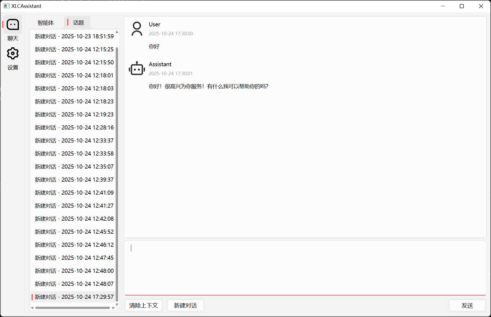
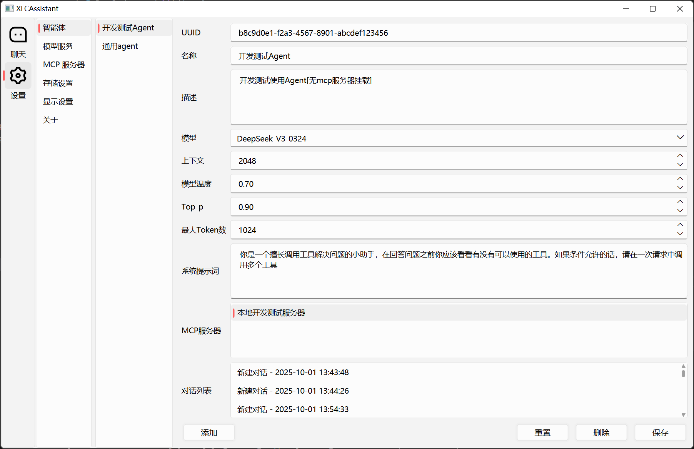

# XLCAssistant - An Advanced LLM & Agent Aggregation Platform

**XLCAssistant** 是一款基于 C++17 和 Qt5(QWidget) 的、由现代 CMake 管理的跨平台模块化AI聚合平台。

该项目的核心亮点在于**自主构建了一套像素级精准控制的UI渲染框架**：通过全面继承 `QProxyStyle` 并结合 `QPainter` 底层绘制，实现了对原生控件的深度美化。功能上支持自定义LLM与Agent，并完整实现了“LLM → tool_calls → MCP协议 → 本地工具执行 → 结果返回LLM”的**闭环智能体工作流**。

---

## 📸 应用截图

### 深色/浅色主题


### 聊天页面



### 设置页面 - Agent



### 设置页面 - LLM


### 工具调用


## ✨ 核心功能

-   **多模型管理**: 支持添加、配置和切换多个大语言模型 (LLM) 服务。
-   **智能体 (Agent) 创建**: 允许用户创建和管理自定义智能体，并为其绑定不同的模型和工具集。
-   **工具调用 (Tool Calls)**: 完整实现了基于MCP协议的外部工具调用工作流，赋予了LLM与本地环境交互的能力。
-   **统一聊天界面**: 提供现代化、高性能的聊天视图，支持代码高亮、多媒体内容等。
-   **深度定制UI**: 所有UI控件都经过重新设计和渲染，提供统一、美观的视觉体验。
-   **数据持久化**: 对话信息通过SQLite进行本地持久化存储。
-   **跨平台**: 基于CMake和Qt，可轻松在Windows和Linux上编译和运行。

## 🚀 技术栈与架构亮点

#### 1. 深度UI定制与高性能渲染 (`QProxyStyle`)

为实现统一且现代化的视觉风格，项目摒弃了局限性大的QSS，转而**自主构建了一套基于 `QProxyStyle` 的深度UI定制系统**。
-   通过 `QPainter` 对超过20种常用控件进行像素级重绘，实现了圆角、阴影、动画等效果。
-   实现了“一行代码换肤“的灵活性和极高的可复用性。
-   针对聊天界面，采用 **Model/View/Delegate** 模型，有效解决了大量消息加载时的卡顿问题，保证了列表的流畅滚动。

#### 2. 泛型UI框架设计 (`BaseSettingsPage.hpp`)

为解决多处配置页面（Agent、LLM等）的重复编码问题，**设计并实现了一套泛型UI配置框架**。
-   通过 **C++模板元编程** 和 `std::function`，将通用的“列表-详情”视图及增删改查逻辑抽象化。
-   极大提升了代码复用率，将添加一个新实体管理页面的工作量减少了80%以上。

#### 3. 系统化的异步与多线程应用

为确保UI的极致流畅，在项目中系统性地应用了异步与多线程思想。
-   将**数据库操作 (`SQLite`) 隔离到独立的 `QThread` 工作线程**，避免了IO阻塞。
-   使用 `QNetworkAccessManager` 处理所有**异步网络API请求**。
-   利用 `QtConcurrent` 执行文件保存等耗时操作，并通过信号槽机制保证线程安全。

#### 4. 闭环智能体 (Agent) 架构设计

为保证系统健壮性与高性能，在Agent工作流的设计中攻克了以下关键点：
-   **工具命名空间管理**: 通过为工具引入唯一标识符和创建映射哈希表，从根本上解决了聚合多个MCP服务器时可能出现的**工具命名冲突**问题。
-   **客户端惰性初始化**: 设计并实现了MCP客户端的**按需连接（On-Demand）机制**。仅在首次调用特定服务器的工具时才建立网络连接，此举显著降低了应用的**启动时间和闲置资源占用**。

## 🛠️ 开始使用

### 依赖环境

-   C++17 兼容的编译器 (MSVC 2019+, GCC 9+)
-   CMake (3.15+)
-   Qt (5.15.2 或更高版本)
-   (可选) spdlog (需要手动安装)

### 编译步骤

```bash
# 1. 克隆仓库
git clone https://github.com/your-username/XLCAssistant.git
cd XLCAssistant

# 2. 创建并进入build目录
mkdir build
cd build

# 3. 运行CMake进行配置
# 如果Qt没有在系统环境变量中，你需要手动指定Qt的路径
# cmake .. -DCMAKE_PREFIX_PATH=/path/to/your/Qt
cmake ..

# 4. 编译项目
cmake --build . --config Release
```